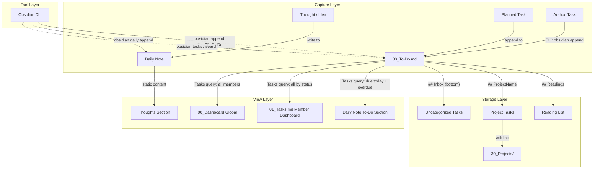

# 2ndBrain 动态任务流重构设计

> 日期: 2026-04-02
> 状态: Approved

## 核心理念

**"记录归记录、任务归任务、日记即看板"** —— 将任务存储（To-Do 文件）与想法捕获（日记）彻底分离，同时让日记通过动态查询充当每日看板。

## 架构变更总览



## Obsidian CLI 适配说明

Obsidian CLI (v1.12.4+) 是 Obsidian 官方内置的命令行工具，需要 Obsidian 处于运行状态。

**关键限制**: CLI 的 `append`/`prepend` 只能操作文件级别（追加到末尾/开头），**不支持按 Heading 定位插入**（[Feature Request](https://forum.obsidian.md/t/enhanced-cli-append-prepend-target-content-to-specific-headings/111768) 待实现）。

**设计适配**: 将 `## Inbox` 置于 To-Do 文件最底部，使 `obsidian append` 自然将新任务落入 Inbox 区域。项目 Heading 的任务组织在编辑器中手动完成（"Clarify" 整理环节）。

**与 2ndBrain 相关的核心命令**:

| 场景 | 命令 |
|------|------|
| 追加任务到 To-Do | `obsidian append file="00_To-Do" content="- [ ] 新任务 📅 2026-04-05"` |
| 追加想法到日记 | `obsidian daily:append content="刚想到一个点子..."` |
| 查看今日日记 | `obsidian daily:read` |
| 列出所有任务 | `obsidian tasks format=json` |
| 创建任务 | `obsidian task:create content="做某事" tags="next"` |
| 完成任务 | `obsidian task:complete task=<task-id>` |
| 搜索仓库 | `obsidian search query="关键词" format=json` |
| 查看文件结构 | `obsidian folders format=tree` |
| 从模板创建笔记 | `obsidian create name="新项目" template="tpl_member_todo"` |

**未来愿景**: 将 Obsidian CLI 的常用操作封装为 Agent Skill，让 AI Agent 能够自动化地与用户协作处理日程管理、任务管理和知识库管理。

## 模块 1: 新增 To-Do 文件模板

**文件**: `99_System/Templates/tpl_member_todo.md` (新增)

每个成员的主待办清单，Append-only 模式，Headings 分区管理。**Inbox 置于底部**以适配 CLI append 操作。

```markdown
# To-Do

## Readings

## Inbox
```

- **`## Readings`**: 阅读/观看/收听清单（原日记 `## Readings` 迁移至此），位于上方固定区域
- **项目 Heading**: 用户按需在 Readings 和 Inbox 之间添加 `## ProjectName`，下方第一行用 blockquote 放 wikilink 指向 `30_Projects/`
- **`## Inbox`**: 所有新任务的默认着陆区，**位于文件最底部**。通过 `obsidian append` 追加的任务自然落入此区域。整理时在编辑器中将任务移到对应项目 Heading 下
- 标签沿用现有约定: `#next`, `#waiting`, `#someday`, `📅 YYYY-MM-DD`
- 已完成任务 `[x]` 留在原位，定期归档到 `09_Done.md`

**使用示例**（整理后的状态）:

```markdown
# To-Do

## Readings

- [ ] [[深度工作]] #read
- [ ] The Pragmatic Programmer #read 📅 2026-04-15

## Project A

> [[30_Projects/Project A]]

- [ ] 完成原型设计 📅 2026-04-03
- [ ] 准备评审材料 #next
- [ ] 收集用户反馈 #waiting

## Refactor 2ndBrain

> [[30_Projects/Refactor 2ndBrain]]

- [ ] 重写日记模板 📅 2026-04-02
- [ ] 更新 Dashboard 查询 📅 2026-04-03

## Inbox

- [ ] 买咖啡豆 📅 2026-04-05
- [ ] 回复张三邮件
- [ ] 看一下那个 API 文档
```

**成员目录结构**:

```
10_Inbox/{Member}/
  00_To-Do.md        # Append-only 待办清单 (数据源, Inbox 在底部)
  01_Tasks.md        # 个人全景看板 (查询视图)
  09_Done.md         # 完成归档
  YYYY-MM-DD.md      # 日记 (想法 + 今日看板)
```

## 模块 2: 日记模板重构

**文件**: `99_System/Templates/tpl_daily_note.md` (修改)

从三区（Works/Thoughts/Readings）精简为两区（To-Do 动态查询 + Thoughts 手写区）。

````markdown
# {{date:YYYY-MM-DD dddd}}

## To-Do

```tasks
not done
(has due date) AND (due before tomorrow)
path includes {{query.file.folder}}
description regex matches /\S/
group by heading
sort by due date
```

## Thoughts
````

- **`## To-Do`**: Tasks 插件查询，拉取截止日期在今天及之前的未完成任务，按来源 Heading 分组（显示 Inbox / Project A / Readings 等）
- **`## Thoughts`**: 想法/灵感/反思的手写区，日记的主体。通过 `obsidian daily:append` 可以从终端快速追加想法
- 去掉 `## Works` 和 `## Readings`（功能由 To-Do 文件和查询接管）

## 模块 3: Dashboard 查询更新

**文件**: `00_Dashboard/01_All_Tasks.md` (修改)

所有查询板块的核心变更:

- **路径过滤**: 从排除规则改为正向匹配 `path includes To-Do`
- **分组方式**: 从按 Thoughts/Works 区分改为 `group by heading`（按项目）+ `group by filename`（按成员）
- **保留的板块**: 今日必达、立即行动、等待跟进、下一步行动、未来计划、阅读清单、Agent 待办

示例 — "今日必达" 更新后:

```
not done
has due date
due before tomorrow
tag does not include #someday
tag does not include #waiting
tag does not include #next
heading does not include Readings
description regex matches /\S/
path includes To-Do
group by filename
group by heading
sort by due date
limit 100
```

**文件**: `99_System/Templates/tpl_member_tasks.md` (修改)

同样更新查询逻辑，`path includes` 改为匹配 To-Do 文件。

## 模块 4: member 命令更新

**文件**: `src/commands/member.js` (修改), `src/lib/config.js` (修改)

- `member` 命令初始化时额外创建 `00_To-Do.md`（使用 `tpl_member_todo.md`）
- `config.js` 的 `FRAMEWORK_FILES` 列表添加 `tpl_member_todo.md`
- 保留 `01_Tasks.md` 和 `09_Done.md` 的创建

## 模块 5: 文档合并

**文件**: `README.md` (修改), `AGENTS.md` (改为软链接), `CLAUDE.md` (改为软链接)

- 将 `AGENTS.md` 中的 AI 助手指南、任务格式、目录约定等内容合并到 `README.md` 新章节
- 将 `CLAUDE.md` 中的架构说明合并到 `README.md`
- 原文件改为指向 `README.md` 的软链接: `ln -s README.md AGENTS.md`, `ln -s README.md CLAUDE.md`
- 更新 README 中的工作流描述，反映新的 To-Do + 日记看板架构

## 模块 6: Obsidian CLI 引导

在 README 中新增 `## Obsidian CLI` 章节:

- 安装激活步骤（更新 Obsidian v1.12.4+ -> Settings -> General -> 启用 CLI -> 注册到 PATH）
- 分平台的 PATH 配置说明（macOS/Windows/Linux）
- 与 2ndBrain 工作流结合的常用命令示例
- AI Agent 集成场景（通过 Obsidian CLI 实现自动化协作）
- 未来封装为 Agent Skill 的愿景说明

## 不变的部分

- PARA 目录结构 (`20_Areas/`, `30_Projects/`, `40_Resources/`, `90_Archives/`)
- 标签约定 (`#next`, `#waiting`, `#someday`, `📅`)
- Agent 协作设计 (`10_Inbox/Agents/Journal.md`)
- `09_Done.md` 完成归档
- `00_Dashboard/09_All_Done.md` 完成记录看板
